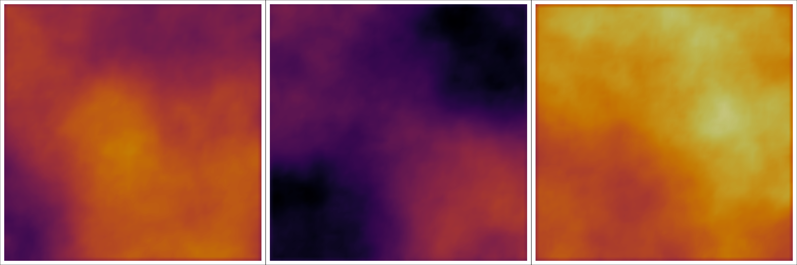

# dolfinx-bilaplacian
This package contains an implementation for a infinite-dimensional Gaussian
measure, with covariance operator given by the bi-Laplacian.
Built on top of the FEM library
[fenicsx](https://fenicsproject.org/).



## Installation
In the file ``bilaplacian.py``, we provide the class with the below signature.
Rather than bother with package managers and the like, it's probably easier for
all parties if you simply include this source into your application. Only
dependencies are `numpy`, `scipy`, and `fenicsx`.

```python
class Bilaplacian:
    def __init__(
        self,
        V: dolfinx.fem.FunctionSpace,
        gamma: float,
        delta: float,
        mean: dolfinx.fem.Function | None = None,
        robin_bc: bool = False,
    ):
        r"""
        Create an infinite-dimensional Gaussian measure with bi-Laplacian covariance
        operator. That is, covariance given by the operator $C = (\delta I + \gamma
        {\rm div} \nabla)^{-2}$.

        Parameters
        ----------
        V: Basis
            Finite element discritization of the space
        gamma: float
            Covariance parameter
        delta: float
            Covariance parameter
        mean : ArrayLike, default: ``0``
            Mean of the distribution.
        robin_bc: bool
            Whether to employ a Robin boundary condition to minimize boundary artifacts.

        Attributes
        ----------
        V: dolfinx.fem.FunctionSpace
            Finite element discritization of the space
        mean : dolfinx.fem.Function, default: ``0``
            Mean of the distribution.
        R: LinearOperator
            Operator for the underlying covariance matrix.
        Rinv: LinearOperator
            Operator for the underlying precision matrix
        A: scipy.sparse.sparray
            Discretization of bi-Laplacian operator
        Ainv: LinearOperator
            Facotrized linear operator representing $A^{-1}$.
        M: scipy.sparse.sparray
            Discretization of underling mass matrix
        Minv: scipy.sparse.sparray
            Operator representing $M^{-1}$.
        sqrtM: scipy.sparse.sparray
            Matrix square root of M
        sqrtMinv: scipy.sparse.sparray
            Inverse for matrix square root of M

        Methods
        -------
        logpdf(x)
            Evaluate $||x-x_0||_{R^{-1}}$ where $x_0$ is the mean.
        grad_logpdf(x)
            Evaluate $R^{-1} (x-x_0)$ where $x_0$ is the mean.
        rvs(size=1)
            Sample ``size`` samples from the measure.
```
